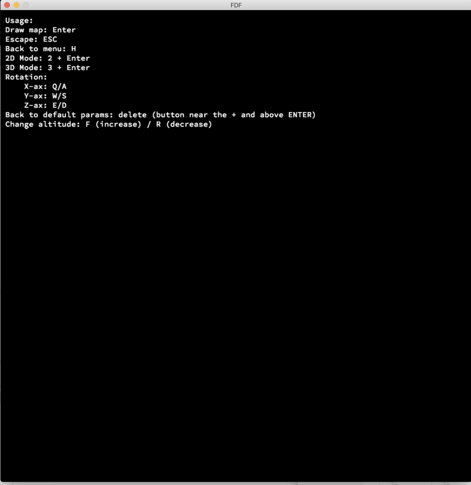
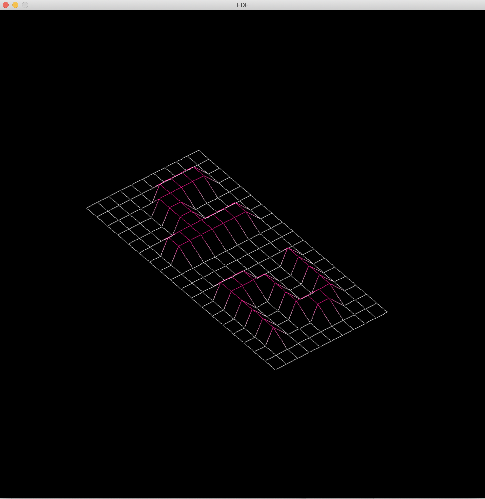
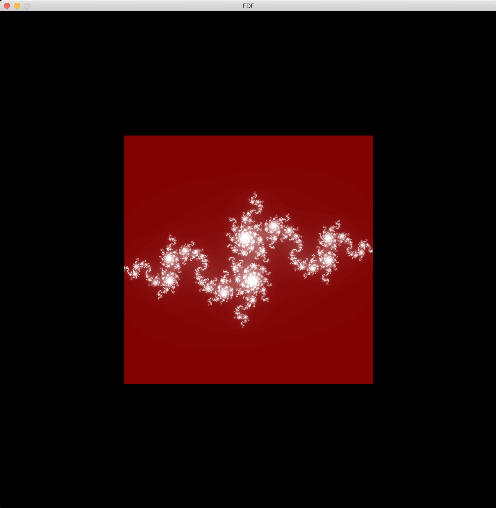
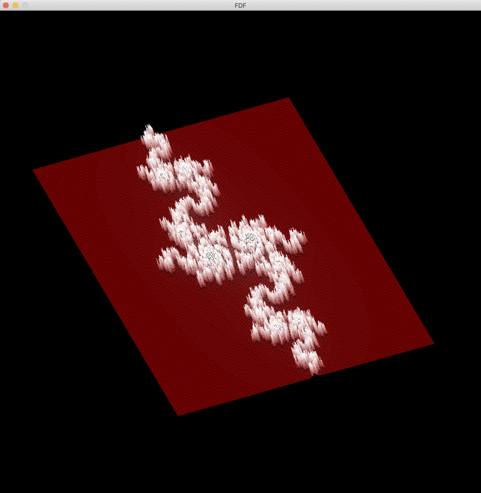
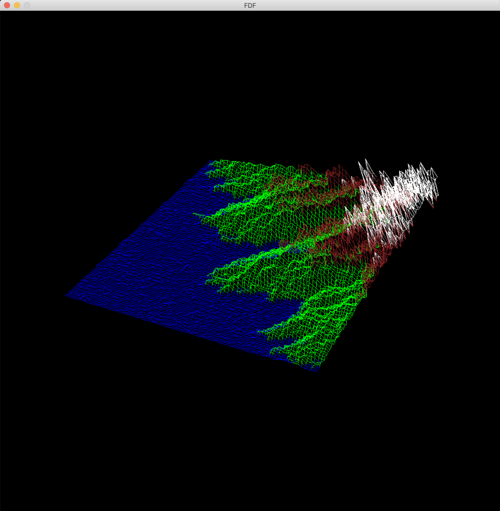

# FDF :earth_americas:

## Description
Simple wireframe model representation of a 3D landscape. 
The coordinates of the landscape are stored in a file passed as a parameter to the program. 

The program allows you to rotate, zoom, change altitude and translate your map.

## Usage
* Download this repo and go to folder fdf;
* Create executable file **`fdf`** using command **make**;
* Run programm **fdf** (**`./[name of program] [file_with_map]`**). You can find examples of maps in folder "test_maps".

## Examples

  
Menu window. Click to expand

  
  > 

  
42 map. Click to expand

  
  > 

  
Julia fractal map (2d). Click to expand

  
  > 

  
Julia fractal map (3d). Click to expand

  
  > 

  
Random map. Click to expand

  
  > 

